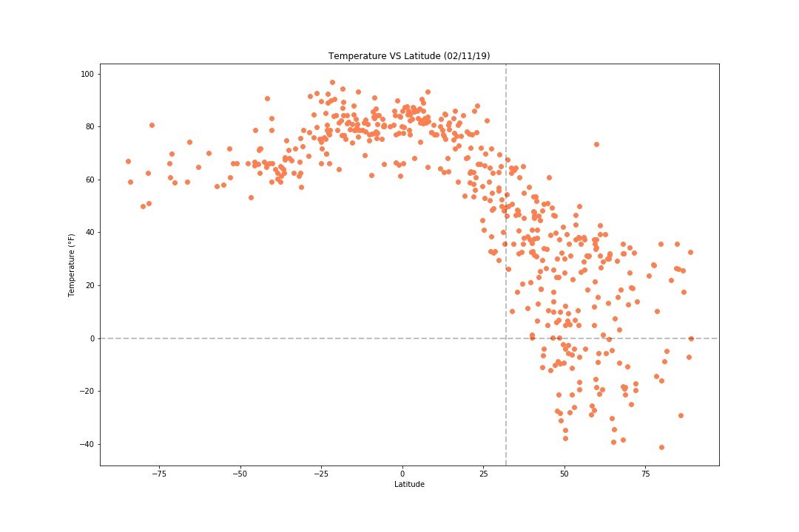
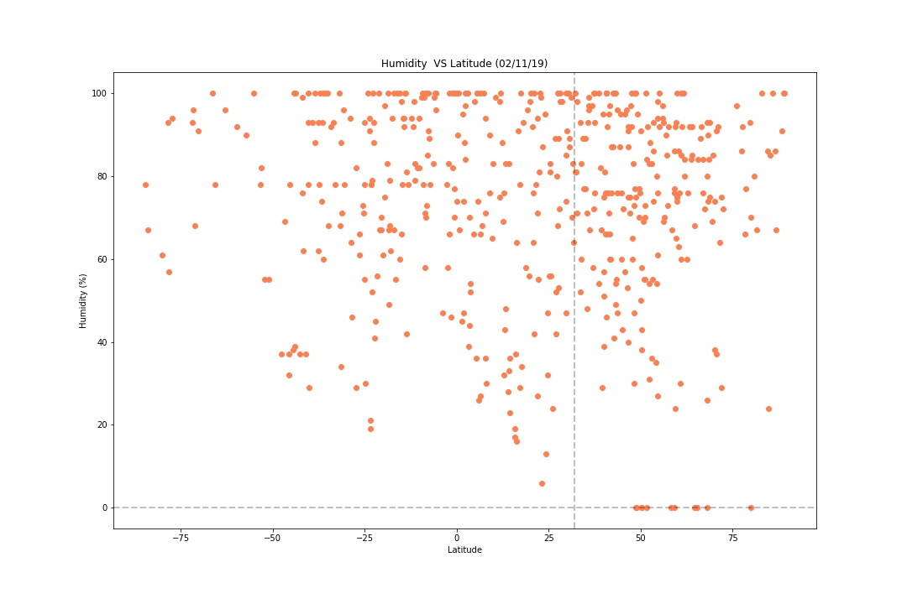
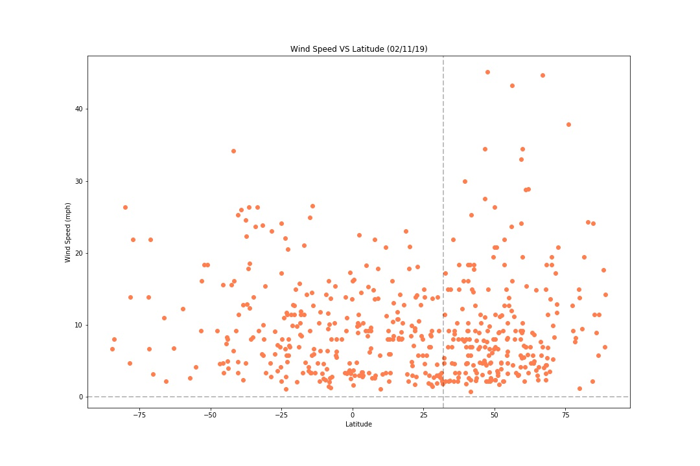

# What's the Weather Like?

Whether financial, political, or social, data's true power lies in its ability to answer questions definitively and this project uses Python requests, APIs, Matplotlib library and JSON traversals to do just that.

"What's the weather like as we approach the equator?" Obviously, it gets hotter. But, if pressed, how would you prove it?

This example, uses Python scripts to visualize the weather of 500+ cities across the world of varying distance from the equator by utilizing a Python library(citipy), the [OpenWeatherMap API](https://openweathermap.org/api), and a little common sense to create a representative model of weather across world cities.

To achieve this, a series of scatter plots was built to showcase the following relationships:
* Temperature (F) vs. Latitude
* Humidity (%) vs. Latitude
* Cloudiness (%) vs. Latitude
* Wind Speed (mph) vs. Latitude

The WeatherPy notebook includes:
* Randomly selected at least 500 unique (non-repeat) cities based on latitude and longitude.
* A weather check on each of the cities using a series of successive API calls.
* A print log of each city as it's being processed with the city number and city name.
* A CSV of all data retrieved and jpg images for each scatter plot.

## Analysis

* The graph above confirms our prediction; it does get warmer as you approach the equator

* Cities with Latitude ranging between -50 and 65 tend to be more humid compared to those further away from that range.

* How the Latitude affects Wind Speed is pretty relative because while some cities further away from the equator (Nothern and Southern Hemisphere) have greater wind speed the relationship between both is not very significant as the majority of the cities' wind speed range from ~(1-15)mph.
